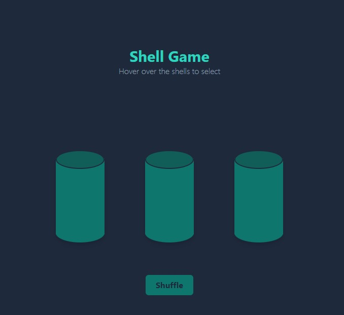

# Shell Game

Shell Game is a classic betting game in which someone hides a bull under three cups/ shells, move it around quickly and allow the other person to guess.

https://shell-game.riaanjlagrange.com

## Run Locally

Clone the project

```bash
  git clone https://github.com/riaanjlagrange/shell-game
```

Go to the project directory

```bash
  cd shell-game
```

Install dependencies

```bash
  npm install
```

Start the server

```bash
  npm run dev
```

## Tech Stack

**Client:** React, TailwindCSS

## Screenshots


